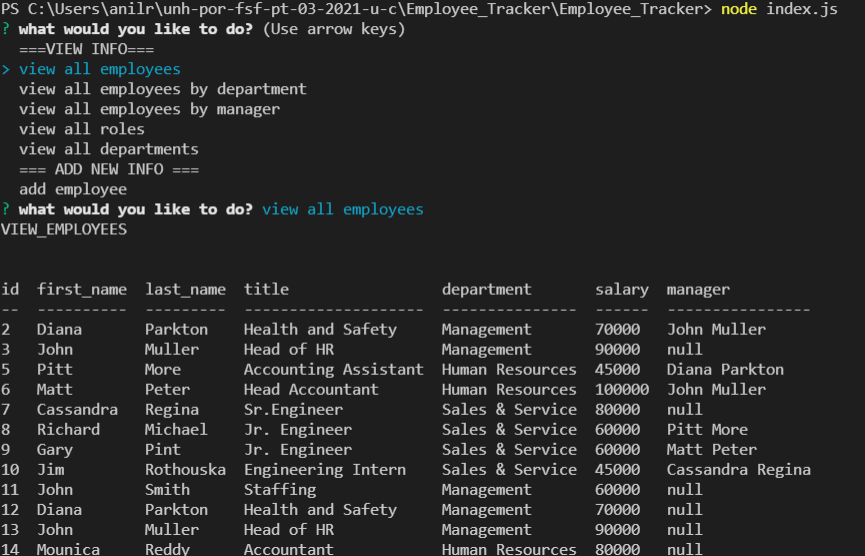

# Employee_Tracker

# Your Task

Task is to architect and build a solution for managing a company's employees using node, inquirer, and MySQL.

# User Story

As a business owner
I want to be able to view and manage the departments, roles, and employees in my company
so that I can organize and plan my business.

# Acceptance Criteria

1. When I try to add departments ,role, employees through command-line it should allow users to do so, the added values are added in MySql database.

2. When I try to view departments, roles, employees through command-line it should allow users to do so, retreiving from MySql database.

3. When I try to update employee roles, should be able to update the role through command-line and the updated values are reflected in MySql database.

# Mock-Up
The following image shows a mock-up of the generated appearance and functionality:

# Link to the recording video
https://github.com/swethareddyl/Employee_Tracker/blob/main/assets/EmployeeTrackerRecording.webm

# Github Link
https://github.com/swethareddyl/Employee_Tracker

